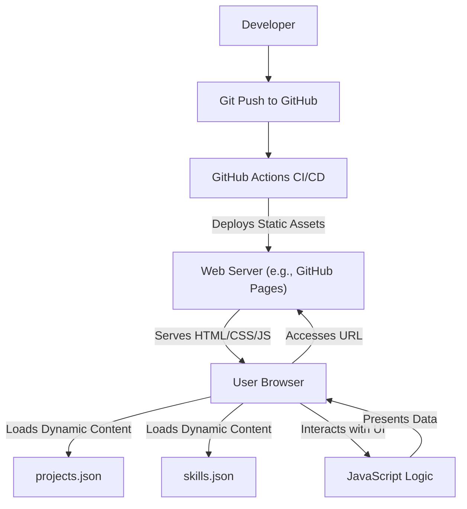

# 🚀 Portfolio Website

<p align="center"></p>

## Short Description
A dynamic, responsive, and meticulously crafted personal portfolio website designed to captivate and inform. This project serves as a compelling digital resume, showcasing a professional's skills, projects, and work experience through an intuitive and engaging user interface, underpinned by modern web technologies and streamlined with continuous deployment.

## ✨ Key Features
*   **Dynamic & Engaging UI:** Leveraging `particles.min.js` and custom JavaScript, the website offers a visually captivating and interactive experience, ensuring visitors are immediately drawn in.
*   **Comprehensive Professional Showcase:** Features dedicated, well-structured sections for detailing an individual's skills (powered by `skills.json`), projects (`projects/projects.json`), and professional journey (`experience/index.html`).
*   **Automated Deployment:** Integrates a robust CI/CD pipeline using GitHub Actions, guaranteeing continuous integration and automated, hassle-free deployment for every update.
*   **Responsive Design:** Engineered to deliver an optimal viewing experience across an extensive range of devices, from desktops to tablets and smartphones.
*   **Downloadable Resume:** Provides convenient access for recruiters and collaborators with a direct link to a downloadable professional resume (`assests/resume.pdf`).
*   **Custom 404 Page:** Enhances user experience and site professionalism with a custom-designed error page for gracefully handling broken links.

## Who is this for?
This project is an invaluable asset for:
*   **Developers & Designers:** Seeking a stellar blueprint or inspiration for constructing their own modern and interactive online portfolio.
*   **Job Seekers & Professionals:** Aiming to create a distinguished and easily navigable platform to present their technical expertise, creative projects, and career milestones.
*   **Hiring Managers & Recruiters:** Offering an intuitive, engaging, and efficient pathway to explore a candidate's full spectrum of abilities and accomplishments.
*   **Collaborators & Networking Enthusiasts:** Individuals looking to connect with a skilled professional through a polished and informative online presence.

## Technology Stack & Architecture
This portfolio stands as a testament to efficient, modern web development, primarily functioning as a static site application built with:

*   **Frontend Technologies:**
    *   **HTML5:** Provides the foundational structure for all web content, ensuring semantic and accessible markup.
    *   **CSS3:** Powers the aesthetics, animations, and responsive design, delivering a polished and adaptive user interface.
    *   **JavaScript (ES6+):** Drives interactivity, dynamic content loading (e.g., skill sets and projects), and engaging visual effects with libraries like `particles.min.js`.
*   **Content Management:**
    *   **JSON:** Utilized for storing and dynamically rendering structured data such as project details (`projects/projects.json`) and diverse skill categories (`skills.json`), allowing for easy content updates without touching the core HTML.
*   **Continuous Integration/Continuous Deployment (CI/CD):**
    *   **GitHub Actions:** Automates the entire development workflow, from pushing code to testing and deploying the website, ensuring consistency and rapid iteration.

## 📊 Architecture & Database Schema
This project employs a client-side architecture, serving static assets and dynamically populating content using local JSON files, rather than relying on a traditional database.



## ⚡ Quick Start Guide
To quickly set up and run this portfolio website locally, follow these straightforward instructions:

1.  **Clone the Repository:**
    Start by cloning the project to your local machine:
    ```bash
    git clone https://github.com/srushtipatil494-tech/portfolio_website.git
    cd portfolio_website
    ```
2.  **Open in Browser:**
    Navigate to the project directory and open `index.html` directly in your web browser.
    ```bash
    # For macOS users:
    open index.html
    # For Windows users:
    start index.html
    ```
    **Alternatively (Recommended for full functionality):** Use a local web server (e.g., Python's SimpleHTTPServer or Live Server VS Code extension) to serve the files.
    ```bash
    python -m http.server 8000
    # Then, open your browser and navigate to http://localhost:8000
    ```
3.  **Customize Your Content:**
    Personalize the portfolio by updating your information:
    *   Modify `projects/projects.json` and `skills.json` with your own projects and abilities.
    *   Replace `assests/resume.pdf` with your current resume.
    *   Update images in `assests/images/` and tweak styles in `assests/css/style.css` to match your brand.

## 📜 License
This project is open-sourced under the terms of the [MIT License](LICENSE).